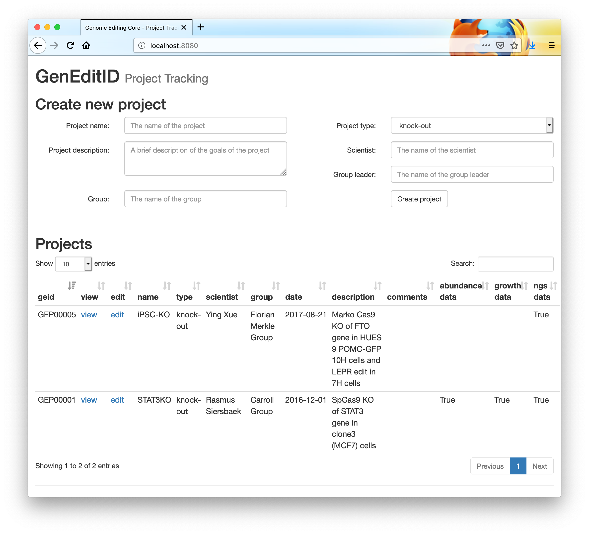

# GenEditID

GenEditID is a flexible, open-access workflow to facilitate the identification of cell clones that have desirable CRISPR-Cas9-induced gene edits. It allows sample tracking, analysis and integration of multiplexed deep sequencing, and intuitive plate-based data visualisation.

## Documentation

[GenEditID Manual: detailed steps](manual.md)

## Contributors

- Ruben Alvarez [@rubenalv](https://github.com/rubenalv)
- Rich Bowers [@rich7409](https://github.com/rich7409)
- Chandu Chilamakuri [@chilamakuricsreddy](https://github.com/chilamakuricsreddy)
- Iman Mali [@im483](https://github.com/im483)
- Florian Merkel [Merkel Lab](http://www.merklelab.org/)
- Anne Pajon [@pajanne](https://github.com/pajanne)
- Amy Smith [@smith04](https://github.com/smith04)
- Anna-Maria Siegert [@Annemuh](https://github.com/Annemuh)
- Loraine Tung [@lyct2python](https://github.com/lyct2python)

## License

MIT. See [LICENSE](LICENSE.md) for details.
